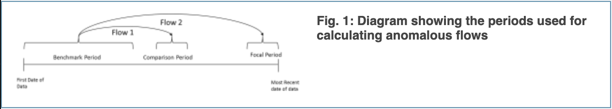
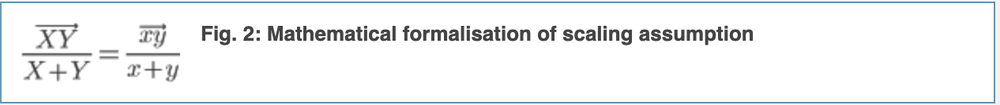
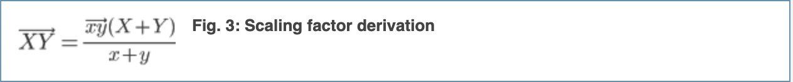
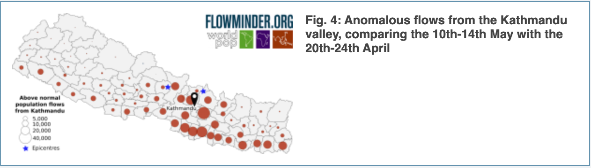
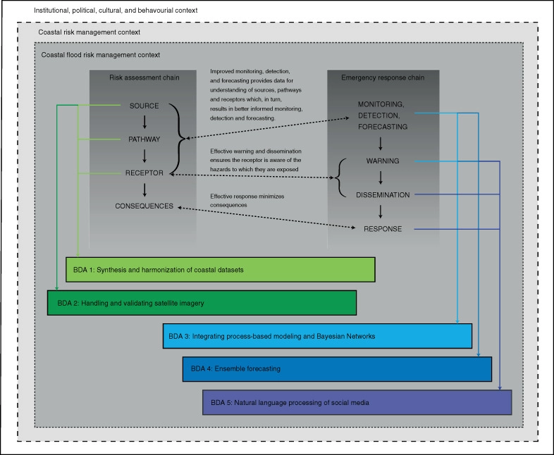

# Assignment 3

Nitu Girish Mohan     

Word Count: 1,531 

---

### Introduction    
As CDR data becomes more and more available, due to rising mobile phone ownership rates, it is also becoming more valuable for usage during disaster response. Utilizing call detail records, researchers can get a relative estimate of how people are moving. The data includes the location of the closest mobile phone tower at the time of each event; an "event" can be classified as a call, text message, or data download.  This type of data is regularly collected and stored by mobile network operators. But, even then, it has its faults. It can exclude groups, forming a bias in the data. This bias creates a lower chance of rescue for women, poor, rural, young, and elderly. There is also bias between males, females, higher-income groups, and some age-specific groups, who are more likely to own a mobile phone than others. Furthermore, those without access to a cell phone, whether due to their age, economic background, or location, are not counted in the data and can be misrepresented. The exclusion of those without a cellphone can impact the data to underestimate the number of people affected by a disaster and lower their chance of survival. As CDR data can build against those who do not own a mobile phone, women, poor, elderly, etc., is it possible to quantify that bias in order to incorporate it into data analysis for disaster response in South Asian countries?     

Utilizing an evaluative inquiry can help show how much impact this unprecedented bias can have on where rescue resources are allocated and the survival rates of those without a cellphone. If certain groups do not receive enough resources to be rescued or are not provided enough relief aid to build their communities back up, these groups can feel the effects of the disaster many years into the future. If bias is present in the data, it is in our best efforts to localize that bias and understand its influence on the rest of the data, as it can have significant impacts on decisions during disaster response and resource allocation. With this type of inquiry, it can help build an understanding for further questions that arise, for example, many times, one cellphone can represent multiple group/family members; is there a way to quantify that probability and incorporate it in the data? Another is how do different demographics recover in comparison to each other (with vs, without a phone, children vs. elderly)? Finally, how much actual change would arise from completely accurate CDR data? If one phone represents multiple people, does quantification have a viable impact on their recovery and relief in the long-term? An evaluative inquiry will help make a judgment on the effectiveness of CDR data as a disaster response method.     

### CDR-based mobility data     
This method was utilized after the 2015 Gorkha earthquake in Nepal. With a population of 27 million people, Nepal has 26 million mobile phone subscriptions. These subscriptions can help estimate population displacement post-disaster. Data is taken “with the GSMA privacy guidelines developed in the context of the Ebola outbreak.” This meant that the data was de-identified, and “individual-level data” was not used at all. As data was provided, it had to go through preprocessing before being fully analyzed. This brought the volume of data down to a manageable size, which can speed up analysis runtime. This preprocessing involved “removing unused information, and assigning each separate tower location (cell phone towers) a location ID.” Next, a “daily location” was calculated for each subscription; this is simply the “location of the last call the user made that day.” Lastly, researchers sorted the locations based on what region the tower was; this could be a District or a Village Development Committee, for example. Using the preprocessed data, researchers produced a “transition matrix containing the flow of users between each possible pair of locations.” This matrix should exclude short commutes such as a daily commute. This means that having an accurate spatial and temporal scale to calculate displacement is critical. To make sure that the correct flows were taken, the researcher created periods to compare. This entailed pre-earthquake mobility estimates (normal flows), a benchmark period (data from January 1st to April 15 205), a comparison period (April 20-24th, right before the earthquake, and a focal period (post-earthquake flows). These can be seen in Figure 1. 
     
The researchers then proceeded to scale the population flows. They assumed that “the ratio of the flow of SIM cards to the combined number of SIM cards, is representative of the ratio of the actual population to the combined population (Figure 2)”.      
   
This led to a scaling factor that was utilized during the analyses (Figure 3).      
         
They validated this formula by comparing scaled estimates with census population data from before the earthquake; both were relatively close to each other. Preliminary data came in just nine days after the earthquake, and a full report was produced almost two weeks after. Utilizing this data, researchers were able to understand where and the number of people had gone. This also helps build an understanding of where damage was at a higher level. Using this data, they were able to produce an understanding of where large flows were occurring (Figure 4).      
          
This analysis provided helpful and insightful information about human displacement in a highly efficient time frame. Current methods never produce such results within such a short timeframe. Such fast analysis is hugely helpful for humanitarian agencies, disaster response, and allocation of resources/aid.       
This method was utilized after the 2015 Gorkha earthquake in Nepal. With a population of 27 million people, Nepal has 26 million mobile phone subscriptions. These subscriptions can help estimate population displacement post-disaster. Data is taken “with the GSMA privacy guidelines developed in the context of the Ebola outbreak.” This meant that the data was de-identified, and “individual-level data” was not used at all. As data was provided, it had to go through preprocessing before being fully analyzed. This brought the volume of data down to a manageable size, which can speed up analysis runtime. This preprocessing involved “removing unused information, and assigning each separate tower location (cell phone towers) a location ID.” Next, a “daily location” was calculated for each subscription; this is simply the “location of the last call the user made that day.” Lastly, researchers sorted the locations based on what region the tower was; this could be a District or a Village Development Committee, for example. Using the preprocessed data, researchers produced a “transition matrix containing the flow of users between each possible pair of locations.” This matrix should exclude short commutes such as a daily commute. This means that having an accurate spatial and temporal scale to calculate displacement is critical. To make sure that the correct flows were taken, the researcher created periods to compare. This entailed pre-earthquake mobility estimates (normal flows), a benchmark period (data from January 1st to April 15 205), a comparison period (April 20-24th, right before the earthquake, and a focal period (post-earthquake flows). These can be seen in Figure 1. The researchers then proceeded to scale the population flows. They assumed that “the ratio of the flow of SIM cards to the combined number of SIM cards, is representative of the ratio of the actual population to the combined population (Figure 2)”.     This led to a scaling factor that was utilized during the analyses (Figure 3). They validated this formula by comparing scaled estimates with census population data from before the earthquake; both were relatively close to each other. Preliminary data came in just nine days after the earthquake, and a full report was produced almost two weeks after. Utilizing this data, researchers were able to understand where and the number of people had gone. This also helps build an understanding of where damage was at a higher level. Using this data, they were able to produce an understanding of where large flows were occurring (Figure 4). This analysis provided helpful and insightful information about human displacement in a highly efficient time frame. Current methods never produce such results within such a short timeframe. Such fast analysis is hugely helpful for humanitarian agencies, disaster response, and allocation of resources/aid.       

### Bayesian Models         
When forecasting a storm, scientists will employ a "process-based modeling approach." This approach takes account of "spatial gradients both alongshore and cross-shore." But, analyzing this data is very time-intensive and laborious. Though parallel processing is utilized to save time, runtimes can take multiple days. This is valuable time that forecasters and emergency responders cannot let go to waste. Some consequences of this could be that the storm/flood reaches humanity before processing is complete, or new factors change the output of the storm. Utilizing Integrating process-based modeling and Bayesian networks can save a lot of time. It applies a “joint probability to update user-defined prior beliefs about a future event using data from past events.” This allows the model to act as a proxy for process-based modeling. The outputs are “accompanied by percentile-based credibility intervals indicating whether a certain event will occur within user-specified uncertainty bounds.” Bayesian models also allow forecasters to “integrate new data as it becomes available.” Researchers and forecasters have now looked to Bayesian networks to cut down the runtime. They can train a Bayesian network on past flooding events; then, this data can be used to remove processing time that would otherwise be necessary for accurate results. This method also gives them the ability to integrate new factors that become available closer to the time of the storm's landfall. In Praia de Faro, Portugal, Bayesian networks were trained on "20 years of data," and accurately predicted "onshore erosion, overwash depth, and flow velocity. The outputs from this model are useful in preparing specifically before a disaster/storm (as seen below), in contrast to CDR data which is useful post-event. This model can help forecasters get a better understanding of the storm before landfall, get warnings and alerts out earlier, and get warnings/aid to those in rural populations or have less access to mobile phones much earlier and more efficiently as well.    

      

### Conclusion      
Though both these methods are highly effective and efficient at helping before (Bayesian models) and after (CDR data) a disaster, they each have their pitfalls. CDR data can be biased against those without access to a mobile phone or those in rural areas. Mobile phone use is low (or lower on average) in several population groups including children, the elderly, the poorest, and women. This can be quite harmful when women and children are often the most vulnerable post-disaster. “Women and children are often the most vulnerable and most affected in such disasters,” said Dr. Flavia Bustreo, WHO’s Assistant Director-General of Women’s and Children’s Health. “First of all, both women and babies are more susceptible to injuries. The harsh living conditions that follow a disaster like this, with unsafe food and insecure and temporary shelters, affect them disproportionately, especially young children under-five."
Specifically after the Nepal earthquake, “1 million children were living in areas severely affected by the earthquake.” Excluding them from the data can have major effects on their recovery as a demographic. Regarding Bayesian models, there are “no case studies of successful application in the literature.” Furthermore, the usage of Bayesian networks can conflict with current emergency systems. Blending this method will current systems will require proper software/hardware and trained responders; testing such a team would also occur during an "extremely high-pressured scenario," such as an actual flood. 
Despite these downfalls, both methods are majorly useful in advancing disaster preparation and response in comparison to current methods that are inadequate and inefficient. Before we can fully implement these methods, I believe CDR data needs to get an accurate estimate beforehand of who might be excluded and how to account for that, and Bayesian models need to be integrated and accurately trained into current emergency systems. Filling these gaps can provide a more effective disaster response.    

---

References:    

[1]Gething, P., & Tatem, A. (2011, August 30). Can Mobile Phone Data Improve Emergency Response to Natural Disasters? Retrieved September 08, 2020, from https://journals.plos.org/plosmedicine/article?id=10.1371/journal.pmed.1001085       

[2]Wilson, R., Erbach-Schoenberg, E., Albert, M., Power, D., Tudge, S., Gonzalez, M., . . . Bengtsson, L. (2016, February 24). Rapid and Near Real-Time Assessments of Population Displacement Using Mobile Phone Data Following Disasters: The 2015 Nepal Earthquake. Retrieved September 15, 2020, from http://currents.plos.org/disasters/article/rapid-and-near-real-time-assessments-of-population-displacement-using-mobile-phone-data-following-disasters-the-2015-nepal-earthquake/      

[3]Bengtsson, L., Lu, X., Thorson, A., Garfield, R., & Schreeb, J. (2011, August 30). Improved Response to Disasters and Outbreaks by Tracking Population Movements with Mobile Phone Network Data: A Post-Earthquake Geospatial Study in Haiti. Retrieved September 16, 2020, from https://journals.plos.org/plosmedicine/article?id=10.1371%2Fjournal.pmed.1001083       

[4]Joshi, J., Comfort, L. K., Lin, Y., Lan, Z., & Su, Y. (2016, November 3). Tracking Disaster Response and Relief Following the 2015 Nepal Earthquake. Retrieved September 17, 2020, from https://ieeexplore.ieee.org/abstract/document/7809746      

[5]Bodish, L. (2015, May 27). Data Informs Disaster Response in Nepal. Retrieved September 17, 2020, from https://www.uschamberfoundation.org/blog/post/data-informs-disaster-response-nepal/43212      

[6]Khalaf, M., Hussain, A. J., Al-Jumeily, D., Baker, T., Keight, R., Lisboa, P., . . . Al Kafri, A. S. (2018, July 8). A Data Science Methodology Based on Machine Learning Algorithms for Flood Severity Prediction. Retrieved October 14, 2020, from https://ieeexplore.ieee.org/document/8477904/authors      

[7]Pollard, J., Spencer, T., & Jude, S. (2018, July 17). Big Data Approaches for coastal flood risk assessment and emergency response. Retrieved October 14, 2020, from https://onlinelibrary.wiley.com/doi/abs/10.1002/wcc.543      

[8]Duncombe, J. (2019, August 26). Devastating Floods Hit India for the Second Year in a Row. Retrieved October 20, 2020, from https://eos.org/articles/devastating-floods-hit-india-for-the-second-year-in-a-row       

[9]Lu, X., Wrathall, D., Sundsøy, P., Nadiruzzaman, M., Wetter, E., Iqbal, A., . . . Bengtsson, L. (2016, February 22). Unveiling hidden migration and mobility patterns in climate stressed regions: A longitudinal study of six million anonymous mobile phone users in Bangladesh. Retrieved October 20, 2020, from https://www.sciencedirect.com/science/article/pii/S0959378016300140      

[10]Mobile Phone Data to Understand Climate Change and Migration Patterns in Bangladesh. (n.d.). Retrieved October 20, 2020, from https://web.flowminder.org/case-studies/mobile-phone-data-to-understand-climate-change-and-migration-patterns-in-bangladesh      

[11]Women and children most vulnerable as Nepal earthquake takes its toll. (2015, April 28). Retrieved November 13, 2020, from https://www.who.int/life-course/news/earthquake-nepal/en/       

[12]Zhao, Z., Shaw, S., Xu, Y., Lu, F., Chen, J., & Yin, L. (2016, January 26). Understanding the bias of call detail records in human mobility research. Retrieved November 13, 2020, from https://www.tandfonline.com/doi/abs/10.1080/13658816.2015.1137298     

